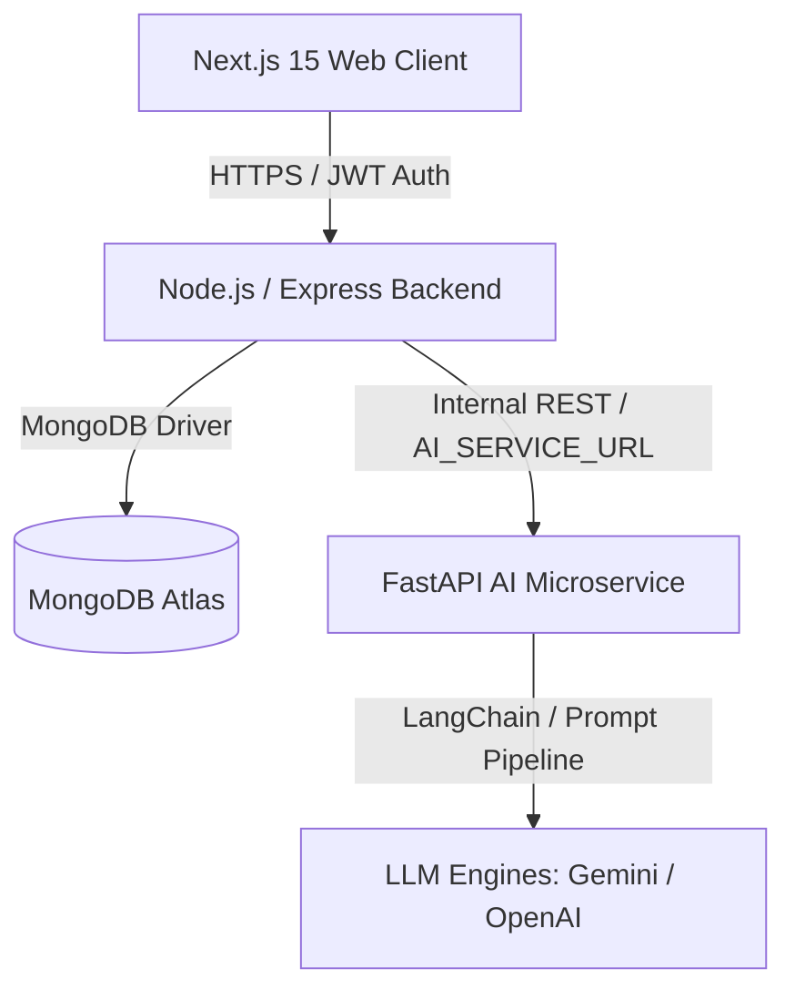

# AI Architecture & Service Contract — EduNova AI

## Architectural Overview

EduNova AI utilizes a decoupled multi-tier architecture separating high-concurrency web interactions, user management, and transactional state from computational AI inference and LLM prompt orchestrations.



---

## 1. Flow of Execution

1. **Frontend**: The student interacts with the Next.js client (e.g. asking a concept question, starting a diagnostic quiz, or requesting a study plan).
2. **Node.js Backend**: 
   - Authenticates the request via JWT `authMiddleware`.
   - Validates user permissions and payload constraints.
   - Forwards structured requests to the FastAPI microservice via `backend/src/services/aiService.ts`.
   - Records session metrics, quiz results, and analytics to MongoDB.
3. **FastAPI AI Service (Rihan)**:
   - Houses educational prompts, RAG document embeddings, and model parameters.
   - Connects to LLMs (Gemini / OpenAI).
   - Returns structured, validated JSON responses.
4. **LLM Provider**: Generates explanations, questions, and adaptive recommendations.

---

## 2. Service Contracts (Phase 2 Integration)

### 2.1 AI Tutor (`/tutor/chat`)
- **Node -> FastAPI**:
  ```json
  {
    "userId": "string",
    "question": "Explain BCNF decomposition",
    "subject": "DBMS",
    "educationLevel": "Undergraduate"
  }
  ```
- **FastAPI -> Node**:
  ```json
  {
    "success": true,
    "response": "Boyce-Codd Normal Form (BCNF) requires...",
    "references": ["DBMS CS301 Syllabus - Chapter 4"],
    "suggestedFollowUps": ["Compare BCNF with 3NF"]
  }
  ```

### 2.2 Adaptive Quiz Generator (`/quiz/generate`)
- **Node -> FastAPI**:
  ```json
  {
    "subject": "Computer Networks",
    "topic": "Congestion Control",
    "difficulty": "Intermediate",
    "numQuestions": 5,
    "educationLevel": "Undergraduate"
  }
  ```
- **FastAPI -> Node**:
  ```json
  {
    "success": true,
    "quizId": "gen-quiz-101",
    "questions": [
      {
        "id": "q1",
        "questionText": "What triggers TCP Reno fast recovery?",
        "options": ["3 Duplicate ACKs", "Timeout", "RST Flag", "FIN Flag"],
        "correctAnswerIndex": 0,
        "explanation": "Three duplicate acknowledgments trigger fast retransmit and fast recovery in TCP Reno."
      }
    ]
  }
  ```

### 2.3 Smart Study Planner (`/planner/generate`)
- **Node -> FastAPI**:
  ```json
  {
    "userId": "string",
    "subjects": ["DBMS", "Computer Networks", "NLP", "Java"],
    "availableHoursPerDay": 3,
    "targetDate": "2026-10-15"
  }
  ```
- **FastAPI -> Node**:
  ```json
  {
    "success": true,
    "planId": "plan-502",
    "schedule": [
      { "date": "2026-09-19", "subject": "NLP", "topic": "Word2Vec", "durationMinutes": 45 }
    ]
  }
  ```

### 2.4 Recommendation Engine (`/recommendations/generate`)
- **Node -> FastAPI**:
  ```json
  {
    "userId": "string",
    "weakTopics": ["NLP — Word2Vec", "Computer Networks — Congestion Control"],
    "performanceScore": 78
  }
  ```
- **FastAPI -> Node**:
  ```json
  {
    "success": true,
    "recommendations": [
      "Focus on NLP for your next 3 study sessions.",
      "Review TCP state machine diagrams before attempting Networks Quiz 7."
    ]
  }
  ```

---

## 3. Boundary & Guardrails
- Node.js backend handles state persistence, rate limiting, and access control.
- FastAPI focuses purely on stateless LLM orchestration and analytical reasoning.
- No direct client-side access to the AI service or LLM API keys.